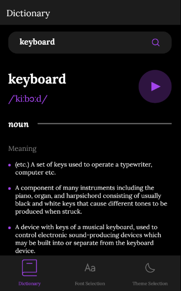
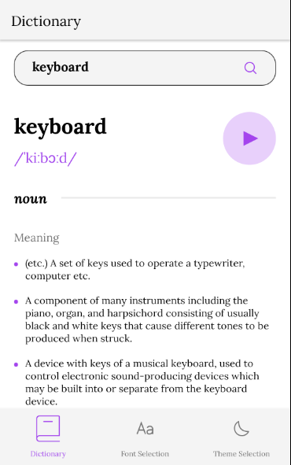
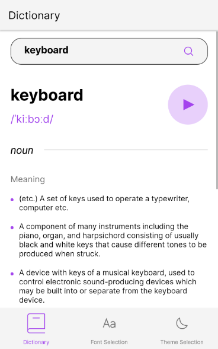
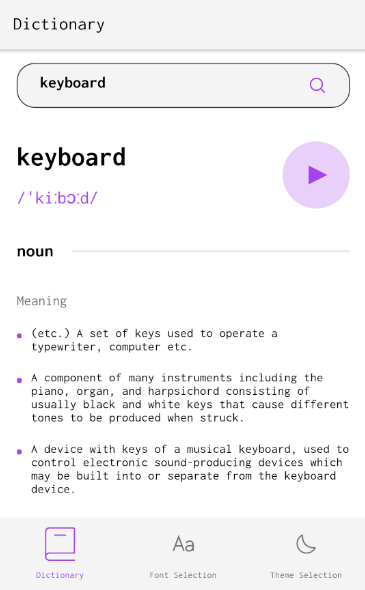
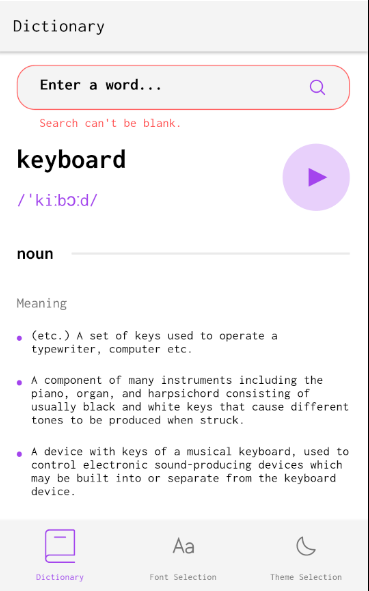
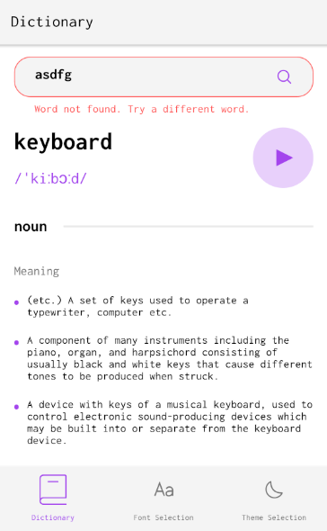
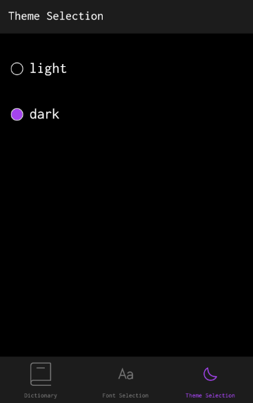
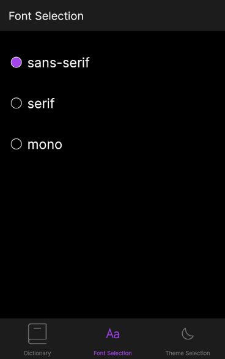

# Dictionary

Coded by Katie Taylor & Kevin Hubbard (with further extensions coded by Katie)

We developed a themed dictionary mobile app for our Mobile Development class at Western Washington University. The app displays definitions and pronunciation (including an audio recording of the pronunciation) for any word accessible in via the [Free Dictionary API](https://dictionaryapi.dev/). Users can navigate freely between the dictionary home screen, theme settings screen and font settings screen.

Run our app on a machine with Expo via `npx expo start`, and connect to the Metro bundler with Expo Go or on your computer with an Android simulator/iOS emulator.

## App UI
The following are screenshots illustrating showing different theme option of our app (using serif font):

[Dark theme:](./design/our-mobile-design-dark.png)

[Light theme:](./design/our-mobile-design-light.png)

You can also switch between 2 other font settings (in addition to the serif font pictured above):

[Sans serif font:](./design/our-mobile-design-sans-serif-font.png)

[Mono font:](./design/our-mobile-design-mono-font.png)

The app also provides error handling feedback to the user on [empty search input](./design/our-mobile-design-blank-search.png):

and when [unable to find the searched word](./design/our-mobile-design-invalid-search.png):

Here are the settings screens in the app:

[Theme settings screen:](./design/our-mobile-design-theme-setting.png)

[Font settings screen](./design/our-mobile-design-font-setting.png)

## Testing

We created automated test suites for the main functionality & error handling (searching for a valid word, searching for an invalid word, handling a blank search, switching between both themes, switching between all fonts, etc.) with Jest.

You can run the Jest tests with `npm run test`.
